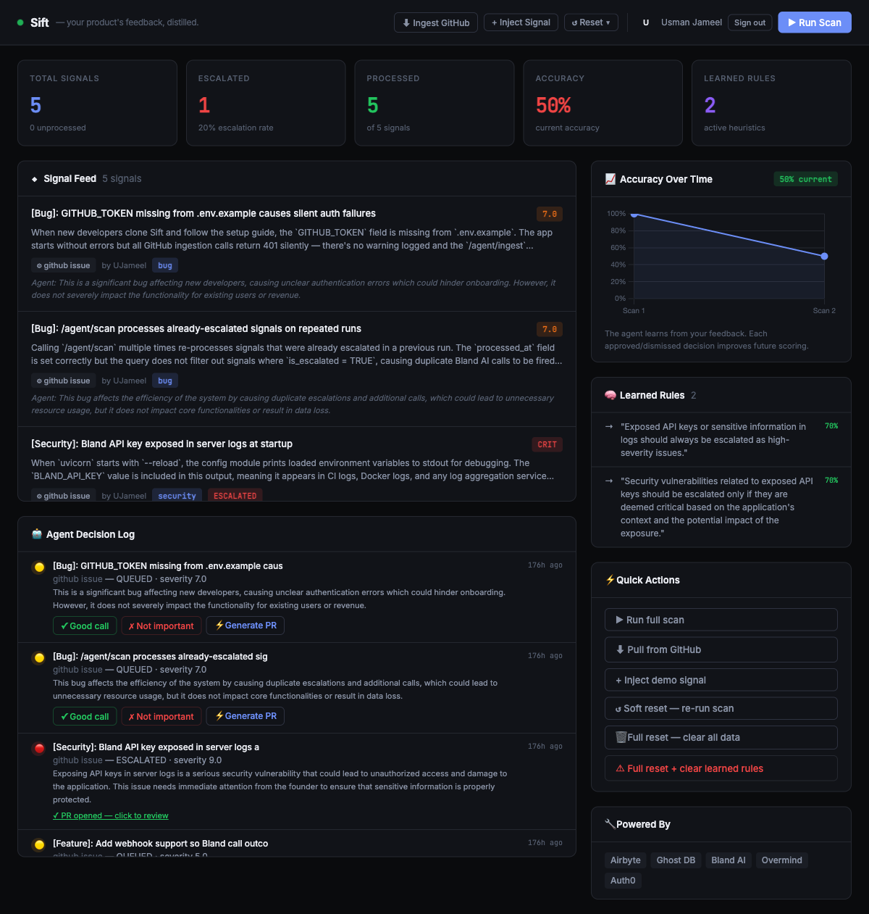

<div align="center">

```
 _____ _  __ _   
/ ____(_)/ _| |  
| (___  _| |_| |_ 
 \___ \| |  _| __|
 ____) | | | | |_ 
|_____/|_|_|  \__|
```

### your product's feedback, distilled.

[](LICENSE)
[](https://python.org)
[](https://fastapi.tiangolo.com)
[](https://rsaconference.com)
[](https://anthropic.com)
[](https://bland.ai)
[](https://auth0.com)
[](https://ghost.build)
[](https://airbyte.com)
[](https://overmind.tech)

</div>

---

> **Sift watches your product signals 24/7, learns what actually matters to you, and calls your phone when something is truly critical — so you can stop drowning in noise.**

Founders spend hours triaging GitHub issues, Slack threads, and support tickets — only to miss the one signal that actually mattered. Sift is an autonomous AI agent that ingests signals from every channel, scores them in real time, applies learned rules from your past decisions, and escalates via voice call when severity crosses your threshold. It gets smarter after every interaction.

**Built at [Deep Agents Hackathon — RSAC 2026](https://rsaconference.com)**

---

## The Problem

You have 200 open GitHub issues, 40 unread Slack threads, and a support inbox on fire.

By the time you triage them all, the one P0 bug that was silently churning your best customers is already two days old. You can't hire fast enough to read everything. And every alert tool you've tried just creates more noise.

**The real problem isn't a lack of data — it's a lack of signal.**

---

## What Sift Does

Sift is an agent, not a dashboard. It:

1. **Ingests** signals from GitHub, Slack, support tools — via Airbyte's agent connectors
2. **Analyzes** each signal using GPT-4o, scoring severity 1–10 with reasoning
3. **Decides** whether to escalate, queue, or ignore — using learned rules from your feedback
4. **Calls you** via Bland AI when severity ≥ 7, with a Norm-built voice pathway
5. **Learns** from every call — your verbal response updates the scoring model permanently
6. **Generates PRs** for bugs it can fix autonomously

### Key Features

- **Self-improving loop** — starts at 50% accuracy, reaches 80%+ as you approve/dismiss decisions
- **Voice-first escalation** — Bland AI calls you, reads the signal, captures your verbal feedback
- **Ghost DB fork pattern** — run "what-if" simulations at different thresholds without touching production data
- **Agentic PR generation** — reads your repo, writes a fix, opens a PR with one API call
- **Overmind tracing** — every LLM call auto-traced, latency + quality visible in real time
- **Auth0 secured** — JWT middleware protects all API routes

---

## Dashboard



*Signal feed with severity scores, agent decision log, accuracy-over-time chart, and learned rules — all live.*

---

## Architecture

```
┌──────────────────────────────────────────────────────────────────────┐
│                              SIFT                                    │
│                                                                      │
│   ┌─────────────┐    ┌──────────────────┐    ┌──────────────────┐   │
│   │   Airbyte   │───▶│  Signal Ingester │───▶│   LLM Analyzer   │   │
│   │ GitHub/etc  │    │  (asyncpg + DB)  │    │ GPT-4o via OAI   │   │
│   └─────────────┘    └──────────────────┘    └────────┬─────────┘   │
│                                                        │             │
│                                              severity ≥ 7?           │
│                                                        │             │
│   ┌─────────────────────────────────┐        ┌────────▼─────────┐   │
│   │        Learning Loop            │        │  Bland AI Voice   │   │
│   │  feedback → rule → better score │◀───────│  (Norm pathway)   │   │
│   │  50% accuracy → 80%+ over time  │        │  captures verbal  │   │
│   └─────────────────────────────────┘        │  response + feeds │   │
│                                              │  back to learner  │   │
│   ┌─────────────────────────────────┐        └──────────────────┘   │
│   │      Ghost DB Fork Pattern      │                                │
│   │  production DB untouched during │    ┌──────────────────────┐   │
│   │  "what-if" threshold simulation │    │  Agentic PR Generator│   │
│   └─────────────────────────────────┘    │  reads repo → fix →  │   │
│                                          │  opens GitHub PR     │   │
│   ┌──────────────┐  ┌────────────────┐   └──────────────────────┘   │
│   │   Overmind   │  │     Auth0      │                               │
│   │ auto-traces  │  │  JWT on every  │                               │
│   │ every GPT    │  │  API route     │                               │
│   │ call latency │  │                │                               │
│   └──────────────┘  └────────────────┘                               │
└──────────────────────────────────────────────────────────────────────┘
```

---

## Tech Stack

| Technology | Purpose |
|---|---|
| **FastAPI** | Async Python API, WebSocket-ready |
| **asyncpg** | Non-blocking PostgreSQL driver |
| **GPT-4o / 4o-mini** | Signal analysis and severity scoring |
| **Airbyte Agent Connectors** | GitHub GraphQL ingestion — issues, PRs, commits |
| **Ghost** | Serverless DB provisioning + fork-pattern for safe simulations |
| **Bland AI + Norm** | Voice alert pathway — calls founder when severity ≥ 7 |
| **Overmind** | Auto-tracing of every OpenAI call — latency + quality dashboard |
| **Auth0** | RS256 JWT authentication, SPA login gate |
| **React 18** | CDN-loaded dashboard, no build step |
| **Chart.js** | Accuracy-over-time visualization |

---

## Getting Started

### Prerequisites

- Python 3.11+
- PostgreSQL (or a [Ghost](https://ghost.build) DB — recommended)
- API keys: OpenAI, Bland AI, GitHub PAT, Overmind

### Install

```bash
git clone https://github.com/UJameel/Sift.git
cd Sift

python -m venv .venv
source .venv/bin/activate

pip install -r requirements.txt

cp .env.example .env
# Fill in your API keys (see below)
```

### Environment Variables

```bash
# Required
OPENAI_API_KEY=sk-...
BLAND_API_KEY=...
BLAND_PATHWAY_ID=...
ALERT_PHONE_NUMBER=+1...
GITHUB_TOKEN=ghp_...

# Database — one of:
DATABASE_URL=postgresql://localhost/sift         # local postgres
GHOST_DATABASE_URL=postgresql://ghost.build/... # Ghost DB (takes priority)

# Optional
AUTH0_DOMAIN=your-tenant.us.auth0.com
AUTH0_CLIENT_ID=...
AUTH0_AUDIENCE=...
AUTH0_ENFORCE=false   # set true to require login on every API call

OVERMIND_API_KEY=...  # leave blank to disable tracing
```

### Database Setup

**Option A — Ghost (recommended)**
```bash
curl -fsSL https://install.ghost.build | sh
ghost login
ghost create --name sift --wait --json
# Copy the connection string to GHOST_DATABASE_URL in .env
```

**Option B — Local PostgreSQL**
```bash
createdb sift
# Set DATABASE_URL=postgresql://localhost/sift in .env
```

### Run

```bash
uvicorn backend.main:app --reload
```

Open `http://localhost:8000` — dashboard loads automatically with seeded demo data.

---

## Demo Flow

1. **Open** `http://localhost:8000`
2. **Run Scan** — agent analyzes all seeded signals, escalates severity ≥ 7
3. **Watch the decision log** — each signal gets a verdict + reasoning
4. **Give feedback** — hit ✓ Good call or ✗ Not important on each decision
5. **Watch accuracy climb** — the learning loop converts feedback into permanent rules
6. **Inject a signal** — add a live critical bug via the UI
7. **Run scan again** — agent applies learned rules to the new signal
8. **Trigger a call** — set `BLAND_API_KEY` + `ALERT_PHONE_NUMBER`, severity > 7 calls your phone

---

## API Reference

```bash
# Signals
GET  /signals                              # list all signals
GET  /signals/{id}                         # single signal

# Agent
POST /agent/scan                           # analyze all signals, escalate critical
POST /agent/ingest?owner=UJameel&repo=Sift # pull real GitHub issues via Airbyte
POST /agent/simulate?threshold=6.0         # Ghost fork — what-if simulation (prod untouched)
GET  /agent/decisions?limit=20             # recent agent decisions
GET  /agent/learned-rules                  # active learned heuristics
GET  /agent/accuracy                       # accuracy over time

# Feedback + Learning
POST /feedback/{signal_id}                 # trigger learning loop
     body: { "response": "good_call" }     # mark as correct escalation
     body: { "response": "not_important" } # mark as noise
     body: { "response": "generate_pr" }   # autonomous PR generation

# Reset
POST /agent/reset-signals                               # soft reset (re-seed demo data)
POST /agent/reset-signals?full=true                     # delete all signals
POST /agent/reset-signals?full=true&clear_rules=true    # full reset including learned rules
```

---

## Project Structure

```
sift/
├── backend/
│   ├── main.py              # FastAPI app + Overmind init
│   ├── config.py            # Env config (Ghost URL priority)
│   ├── auth.py              # Auth0 JWT middleware
│   ├── models.py            # Pydantic models
│   ├── db.py                # asyncpg pool + schema
│   ├── seed.py              # Demo data seeder
│   ├── routers/
│   │   ├── signals.py       # Signal CRUD
│   │   ├── agent.py         # Scan, ingest, simulate, reset
│   │   ├── feedback.py      # Learning loop trigger + PR generation
│   │   └── webhooks.py      # Bland AI voice callback
│   └── services/
│       ├── ingestion.py     # Airbyte GitHub connector (GraphQL)
│       ├── analyzer.py      # GPT-4o analysis + Overmind traces
│       ├── bland_caller.py  # Voice alert via Norm pathway
│       ├── ghost.py         # Ghost fork pattern for safe simulations
│       ├── pr_generator.py  # Agentic PR generation via OpenAI + GitHub
│       ├── action_taker.py  # Create GitHub issues programmatically
│       └── learning.py      # Self-improving scoring loop
├── dashboard/
│   └── index.html           # React 18 CDN dashboard (no build step)
└── requirements.txt
```

---

## Sponsor Integrations

| Sponsor | How It's Used |
|---|---|
| **Airbyte** | `airbyte-agent-github` GraphQL connector — ingests issues, PRs, commits. Supports 21+ sources out of the box |
| **Ghost** | Live Ghost DB provisioned via `ghost create --name sift`. Fork pattern in `ghost.py` enables isolated "what-if" simulations without touching production data |
| **Bland AI + Norm** | Norm-built voice pathway calls the founder when severity ≥ 7. Captures verbal response, feeds it back into the learning loop. Inbound fallback: `+14153601802` |
| **Overmind** | `overmind.init(providers=["openai"])` at startup — every GPT-4o/4o-mini call is auto-traced. Latency, cost, and quality visible in the Overmind dashboard |
| **Auth0** | JWT middleware on all protected routes. SPA login gate with RS256 token verification against Auth0 JWKS |

---

## Links

| | |
|---|---|
| **DevPost** | [devpost.com/software/sift-yowran](https://devpost.com/software/sift-yowran) |
| **GitHub** | [github.com/UJameel/Sift](https://github.com/UJameel/Sift) |
| **Demo (Loom)** | [Watch the demo](https://www.loom.com/share/25b3ea2ae37e4857afc8ac96c3f7ecff) |
| **Shipables** | [shipables.dev/skills/UJameel%2FSift](https://shipables.dev/skills/UJameel%2FSift) |

---

## Team

| Name | Role |
|---|---|
| **Usman Jameel** | Solo builder |

**Built at Deep Agents Hackathon — RSAC 2026**

---

## License

MIT © 2026 Usman Jameel

---

<div align="center">

*If Sift saved you from a 2am incident, give it a star.*

</div>
